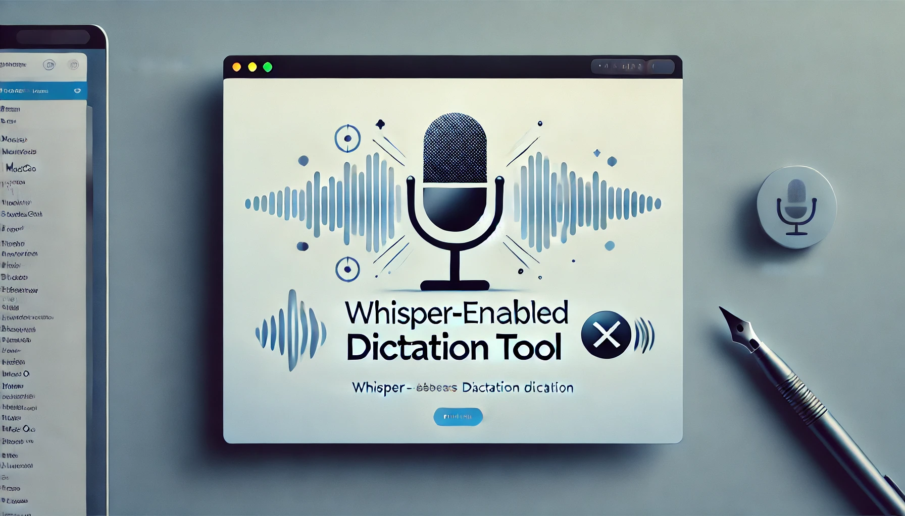
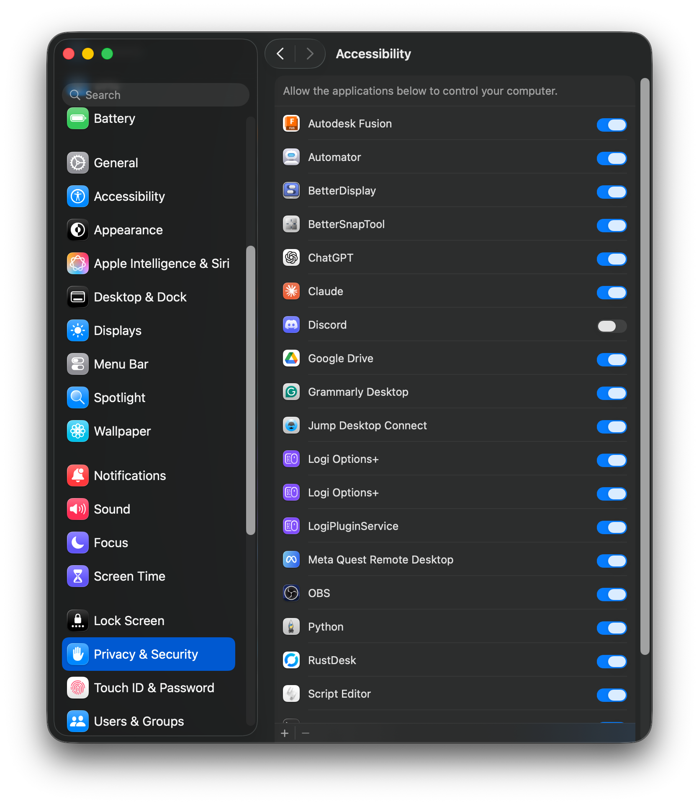
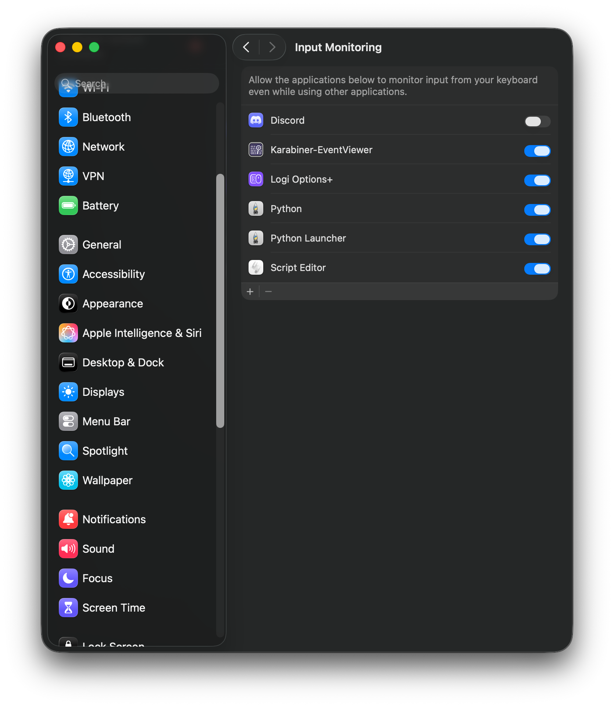
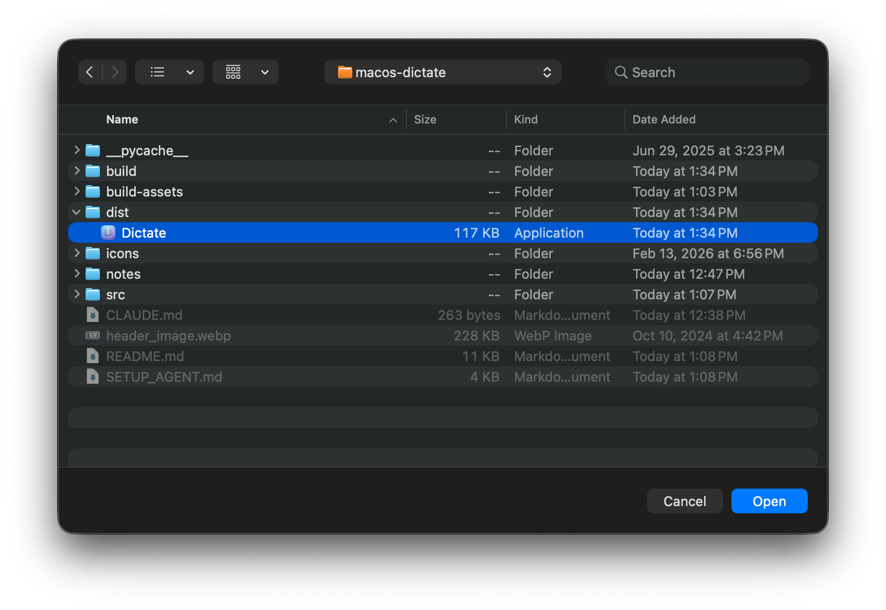
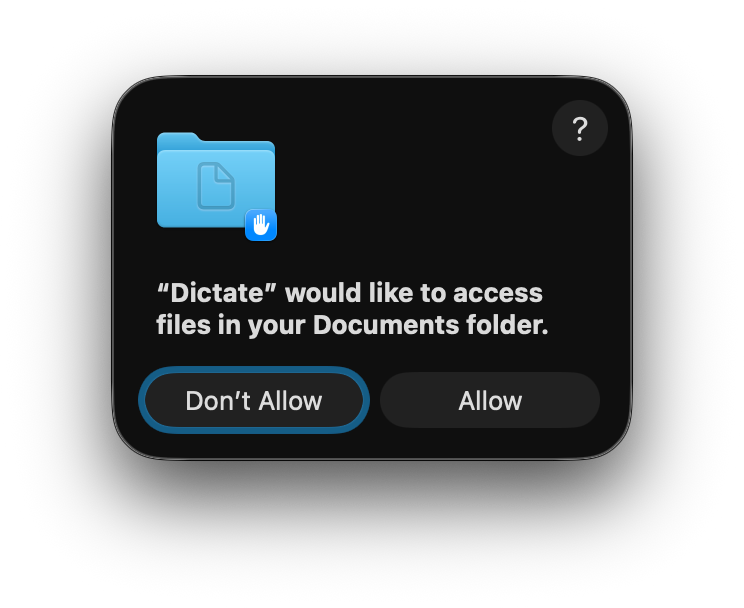
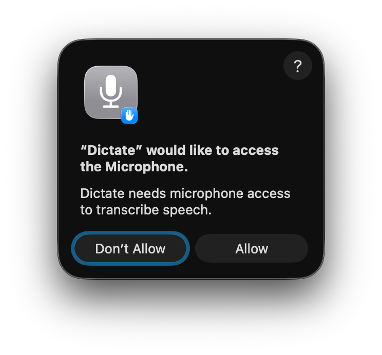

# Whisper Dictation for macOS


A fast, reliable alternative to macOS's built-in dictation, using OpenAI's Whisper model for local speech-to-text. Press a key, speak, and your text is pasted directly into any active application—no cloud, no subscriptions, no lag from broken system dictation.

> **Using an AI coding assistant?** See [`SETUP_AGENT.md`](./SETUP_AGENT.md) for project structure, key variables, and conventions to give your agent full context on this codebase.



---

## Features

### Core

- **One-key dictation**: Press F1 to start, press again to stop and paste
- **Repaste**: F2 repastes your last transcription without re-recording
- **Append-to-file shortcuts**: Dictate directly into specific markdown files (e.g. TODO lists) via configurable key combos
- **Background operation**: No Dock icon, no terminal window, runs silently as a system app
- **Automatic clipboard restore**: Your original clipboard is preserved after each paste
- **Hot-swap microphones**: Seamlessly switch audio input sources without restarting the app

### Text Post-Processing

- **Voice formatting commands**: Say "new line" for line breaks, "dash" for list bullets, "colon" for `:`, "slash" for `/`, "dot" for inline `.` — lets you dictate structured text like file paths, lists, and version numbers hands-free
- **Custom word corrections**: Map Whisper's common mistranscriptions to your preferred terms via a personal `mappings.local.json` file (gitignored) — simple find-and-replace, no special syntax knowledge needed
- **Smart quoting**: Trigger phrases like "called", "say", "a file called" automatically wrap following words in quotes
- **Punctuation cleanup**: Standardizes spacing around punctuation, collapses redundant comma/period clusters, removes extra newlines

### Performance & Reliability

- **Multi-threaded Whisper**: Configured to use all available performance CPU cores (fixes a 5-7x slowdown in `.app` environments on Apple Silicon)
- **App Nap disabled**: macOS won't throttle the app when running in the background
- **Watchdog thread**: Detects audio stream stalls and recovers without user intervention
- **CoreAudio device monitoring**: Detects microphone switches instantly via native OS APIs with polling fallback
- **Race condition protection**: State locking prevents audio data loss between recording and transcription

### App Packaging

- **Native `.app` bundle**: Package as `Dictate.app` via py2app for stable TCC permissions (Accessibility, Input Monitoring, Microphone)—permissions persist across reboots instead of resetting monthly
- **Login item support**: Add to macOS login items for auto-start

---

## Keyboard Shortcuts

| Shortcut | Action |
|---|---|
| **F1** | Start / stop recording → paste transcription |
| **F2** | Repaste last transcription |
| **Cmd+F1** | Record → append as bullet to `APPEND_BULLET_FILE` (see Configuration) |
| **Alt+F1** | Record → append as bullet to `APPEND_BULLET_FILE_2` (see Configuration) |
| **Cmd+Alt+R** | Force-restart the app (use if frozen) |
| **Opt+Shift+D** | Quit |

---

## System Requirements

- **macOS**: 10.15 Catalina or higher (Sequoia tested)
- **Python**: 3.10 or higher (3.12 recommended)
- **RAM**:
  - Minimum: 4GB (tiny/base models)
  - Recommended: 8GB+ (small/medium models)
- **Processor**: Apple Silicon or Intel Core i5+. Apple Silicon recommended for on-device performance.

---

## Installation

### 1. Clone the Repository

```bash
git clone https://github.com/tristancgardner/macos-dictate.git
cd macos-dictate
```

### 2. Install System Dependencies

```bash
brew install portaudio ffmpeg
```

> **Apple Silicon note**: If you encounter PortAudio issues, try `arch -x86_64 brew install portaudio` as a fallback.

### 3. Create a Virtual Environment

```bash
python3 -m venv venv
source venv/bin/activate
pip install --upgrade pip
```

### 4. Install Python Packages

```bash
pip install torch sounddevice numpy pyobjc psutil
pip install git+https://github.com/openai/whisper.git
pip install py2app  # Only needed if you plan to build the .app bundle
```

### 5. Configure `.env.local`

Copy the example config and edit it with your file paths:

```bash
cp .env.example .env.local
```

Edit `.env.local`:

```bash
# Cmd+F1 appends to this file
APPEND_BULLET_FILE=/path/to/your/primary_todo.md

# Alt+F1 appends to this file
APPEND_BULLET_FILE_2=/path/to/your/secondary_todo.md
```

Both variables are optional. If not set, the corresponding shortcut falls through to plain F1 behavior.

### 6. Grant macOS Permissions

Before running, you must grant permissions in **System Settings > Privacy & Security**. Add your terminal app (Terminal, iTerm2, Warp, etc.) to each of these:

1. **Accessibility** — required for the keyboard event tap to intercept shortcuts (F1, F2, etc.)
2. **Input Monitoring** — also required for the keyboard event tap to function
3. **Microphone** — macOS will prompt on first launch; click Allow

Without Accessibility + Input Monitoring, hotkeys won't fire. Without Microphone, no audio is recorded.

> **If you build the `.app` bundle** (see [App Packaging](#app-packaging-optional) below), grant these permissions to `Dictate.app` instead of your terminal. The `.app` gets its own TCC identity so permissions persist across reboots.

---

## Running the Script

```bash
source venv/bin/activate
python src/dictate.py --model small
```

Available models (in order of size):

| Model | RAM | Speed | Accuracy |
|---|---|---|---|
| `tiny` | ~150MB | Fastest | Basic |
| `base` | ~300MB | Fast | Good |
| `small` | ~500MB | Moderate | Better |
| `medium` | ~1.5GB | Slow | High |
| `large` | ~3GB | Slowest | Highest |

> **Note**: The `turbo` model is incompatible with Apple Silicon (extremely slow—do not use).

`small` is the default and recommended starting point.

---

## Packaging as a Native `.app` (Recommended for Daily Use)

Running from Terminal works, but macOS Sequoia resets Terminal's TCC permissions (Accessibility, Input Monitoring) monthly — breaking the app until you re-grant them. Packaging as a `.app` gives Dictate its own stable TCC identity so permissions persist across reboots. The built app lives at `dist/Dictate.app`.

### Build

```bash
python build-assets/setup.py py2app -A
```

The `-A` flag builds in alias mode: the `.app` symlinks to your source files. Code changes in `src/` take effect after a quit and relaunch—no rebuild needed. Only changes to `build-assets/setup.py` require a rebuild.

### Rebuild Script

`rebuild.sh` handles the full cycle automatically:

```bash
./build-assets/rebuild.sh
```

This will:
1. Kill the running instance
2. Clean build artifacts
3. Rebuild and code-sign the `.app`
4. Reset TCC permissions (required after every rebuild)
5. Open System Settings to the relevant permission pages

> **After every rebuild**: You must manually re-add `Dictate.app` in both **Accessibility** and **Input Monitoring** in System Settings, then relaunch.

### Launch

```bash
open dist/Dictate.app
```

Or drag `dist/Dictate.app` to your Applications folder and add it as a Login Item in **System Settings > General > Login Items**.

---

## Grant Permissions

After a rebuild, System Settings opens automatically to these two pages. Click **+** in the bottom left, navigate to `dist/Dictate.app`, and toggle it on in both:

<table><tr>
<td valign="top"><p><strong>1. Accessibility</strong></p></td>
<td valign="top"><p><strong>2. Input Monitoring</strong></p></td>
</tr></table>

**3. Select Dictate.app** from the file picker when you click +



On first launch, macOS will prompt for additional permissions — click **Allow** on both:

<table><tr>
<td valign="top"><p><strong>4. Documents folder access</strong></p></td>
<td valign="top"><p><strong>5. Microphone access</strong></p></td>
</tr></table>

The app cannot intercept keyboard shortcuts without Accessibility + Input Monitoring.

---

## Configuration

### Whisper Model

Pass `--model` when running from the terminal, or modify the default in `src/dictate.py`:

```python
parser.add_argument('--model', type=str, default='small', ...)
```

### Voice Formatting Commands

These let you dictate structured text (file paths, lists, version numbers) without touching the keyboard. They are built into `src/text_postprocessor.py` and work out of the box.

| Say | Output | Notes |
|---|---|---|
| "new line" or "newline" | line break | Retains period on previous sentence |
| "dash." or "hyphen." | `- ` | Only at sentence boundaries (for list bullets). Whisper handles inline hyphenation automatically. |
| "colon" | `:` | |
| "slash" | `/` | Collapses spaces: "src slash utils" → `src/utils` |
| "dot" | `.` | Inline: "config dot yaml" → `config.yaml`. Sentence-ending dots get normal spacing. |
| "three point five" | `3.5` | Also works as "3 point 5" |

**Disabling a command**: If any of these conflict with how you speak, remove or comment out the corresponding entry in `SIMPLE_MAPPINGS` or `COMPLEX_MAPPINGS` in `src/text_postprocessor.py`. Simple mappings are direct word swaps (colon → `:`), while complex mappings use lookaheads for context-sensitive behavior (e.g. "dot" → `.` except before "files"). The contextual commands ("dash."/"hyphen." at sentence boundaries and "X point Y" for numbers) are handled separately in `cleanup_text()` — comment out the relevant `re.sub` line to disable.

### Custom Word Corrections

Separately from voice commands, you can add simple word-for-word replacements to fix Whisper mistranscriptions specific to your vocabulary (names, brands, technical terms).

Copy the example file and add your own entries:

```bash
cp mappings.example.json mappings.local.json
```

Each entry is a pattern → replacement:

```json
{
    "\\bmy brand\\b": "MyBrand",
    "\\bmy-?app\\b": "MyApp"
}
```

This file is gitignored — your personal corrections stay local. Entries are merged with the built-in voice commands at startup. No rebuild needed — just restart the app.

### Quote Trigger Phrases

Edit `QUOTE_TRIGGERS` in `src/text_postprocessor.py`. Words following these phrases are automatically wrapped in single quotes:

```python
QUOTE_TRIGGERS = [
    r'called',
    r'a file called',
    r'a variable called',
    # add your own...
]
```

Say "a file called config dot json" → pastes `a file called 'config.json'`.

### Greedy Quote Triggers

`GREEDY_QUOTE_TRIGGERS` quotes everything after the trigger phrase to the end of the utterance. Default triggers: `say`, `to say`.

### Keyboard Shortcuts

Shortcuts are defined in `src/keyboard.py`. The default keycodes are F1 (`122`) and F2 (`120`). To change them, edit the `keycode ==` checks in that file.

### Append-to-File Shortcuts

Configure in `.env.local` (never committed to git):

```bash
APPEND_BULLET_FILE=/path/to/primary_todo.md     # Cmd+F1
APPEND_BULLET_FILE_2=/path/to/secondary_todo.md  # Alt+F1
```

Each shortcut records and appends the transcription as a markdown bullet (`- your text`) to the specified file.

---

## Troubleshooting

### App won't intercept key presses

Check **System Settings > Privacy & Security > Accessibility** and **Input Monitoring**. Both must include `Dictate.app` (or Terminal if running as a script). After a rebuild you must re-add the app—permissions are tied to the code signature.

### Microphone not working / no audio recorded

- Check **System Settings > Privacy & Security > Microphone**.
- If you switched input devices, the app should detect it automatically via CoreAudio monitoring. If not, use **Cmd+Alt+R** to restart.
- Check `~/.dictate.log` for error details.

### Transcription is slow

- Ensure you're using `small` or `base` model—`turbo` is broken on Apple Silicon.
- If running as `.app`, the first transcription after launch is slower (model load). Subsequent ones should be 2-7s for `small`.
- Check `~/.dictate.log` for `Whisper transcription completed in X.XXs` lines to benchmark.

### App froze / unresponsive

Press **Cmd+Alt+R** to force-restart. The app detects whether it's running as a `.app` or script and relaunches the correct way.

### PortAudio errors

```bash
brew install portaudio
pip uninstall sounddevice && pip install sounddevice
```

### Text doesn't paste into the active app

Ensure the target application accepts `Cmd+V` paste commands. Some apps (certain games, kiosk UIs) block automated input.

---

## Logging

All events are logged to `~/.dictate.log`. Key entries to watch:

- `Whisper transcription completed in X.XXs` — transcription timing
- `Sounddevice/PortAudio device cache refreshed` — only appears on device switch (not every 5s; if you see this spamming, the watchdog loop is broken)
- `Restart skipped: recording in progress` — watchdog fired but correctly deferred
- `CoreAudio: Default input device changed from X to Y` — device switch detected

---

## Planned / Future Features

- [X] Fixed leading space added to every transcription
- [X] Background process (no Dock icon, no Terminal window)
- [X] PID lock to prevent multiple instances
- [X] Hot-swap microphone input without restart
- [X] F2 repaste
- [X] Append-to-file shortcuts (Cmd+F1 / Alt+F1)
- [X] Native `.app` packaging with stable TCC permissions
- [X] Smart text post-processing (corrections, quoting, punctuation)
- [X] Cmd+Alt+R force-restart shortcut
- [X] PyTorch multi-threading fix for `.app` environments
- [X] Voice commands: "new line", "dash"/"hyphen" (list bullets), "dot", "slash", numeric "point"
- [X] Personal word corrections via gitignored `mappings.local.json`
- [ ] Real-time transcription preview
- [ ] Custom voice command macros (bold, italics, etc.)
- [ ] Multi-language support with auto-detection
- [ ] User-defined vocabulary expansion
- [ ] Always-on-top recording indicator

---

## Issues and Feature Requests

- Bug reports: [Submit an issue](https://github.com/tristancgardner/macos-dictate/issues/new?template=bug_report.md)
- Feature requests: [Submit a feature request](https://github.com/tristancgardner/macos-dictate/issues/new?template=feature_request.md)

When reporting a bug, include: macOS version, Python version, model used, and the relevant section from `~/.dictate.log`.

---

## Contributing

Contributions welcome. Fork the repository and open a pull request with your changes.

---

## License

MIT License. See [LICENSE](LICENSE) for details.

---

## Acknowledgments

- [OpenAI Whisper](https://github.com/openai/whisper)
- [PyObjC](https://pypi.org/project/pyobjc/)
- [PortAudio](http://www.portaudio.com/)
- [Homebrew](https://brew.sh/)
- [py2app](https://py2app.readthedocs.io/)
